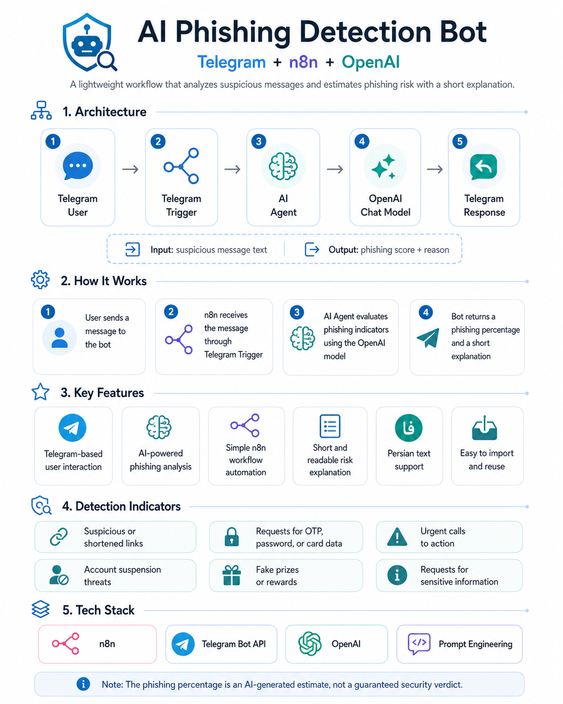
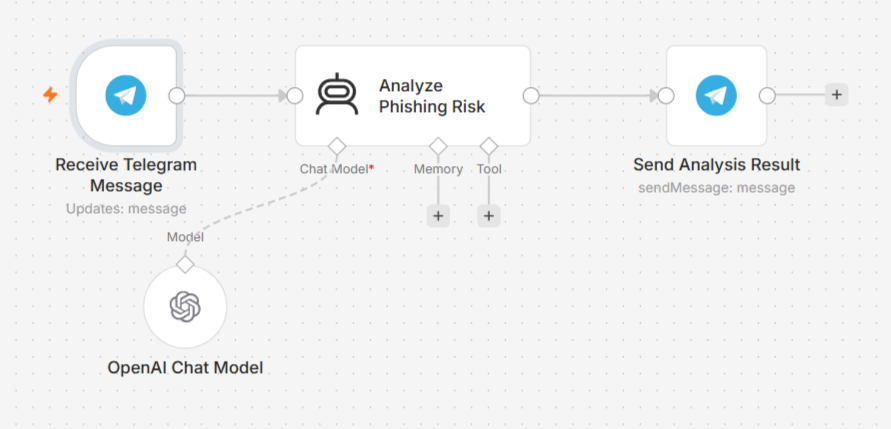

# 🛡️ n8n AI Phishing Detector

An AI-powered Telegram bot built with **n8n** and **OpenAI** that analyzes incoming messages and estimates their phishing risk.

The bot returns:

* A phishing probability score
* A short explanation of the detected warning signs
* A simple and user-friendly Telegram response

## 🎥 Demo

[▶️ Watch the short demo](assets/demo.mp4)

## 🧩 Project Overview



## ✨ Features

* Receives messages through a Telegram bot
* Uses an n8n AI Agent for message analysis
* Connects to an OpenAI Chat Model
* Estimates phishing probability from 0% to 100%
* Explains the main reasons behind the result
* Supports Persian-language messages
* Uses a simple and reusable n8n workflow

## 🏗️ Workflow Architecture

```text
Telegram User
      ↓
Telegram Trigger
      ↓
AI Agent
      ↓
OpenAI Chat Model
      ↓
Telegram Response
```

An architecture infographic will be added to this section.

<!--
After uploading the infographic, replace the sentence above with:


-->

## 🔄 How It Works

1. The user sends a message to the Telegram bot.
2. Telegram Trigger receives the incoming message.
3. The AI Agent sends the message to the OpenAI Chat Model.
4. The model evaluates common phishing indicators.
5. The bot returns the estimated phishing percentage and a short explanation.

## 🧠 Detection Indicators

The AI model considers indicators such as:

* Requests for passwords, OTPs, or card information
* Suspicious or shortened links
* Urgent calls to action
* Threats of account suspension
* Fake prizes or rewards
* Requests for money or sensitive information
* Impersonation of banks or trusted organizations

## 📁 Repository Structure

```text
n8n-ai-phishing-detector
│
├── README.md
│
├── workflow
│   └── phishing-detector-workflow.json
│
└── assets
    ├── demo.mp4
    ├── workflow-overview.png
    └── architecture-infographic.png
```

## 🚀 Setup

1. Import `workflow/phishing-detector-workflow.json` into n8n.
2. Create a Telegram bot using BotFather.
3. Add your Telegram credential to n8n.
4. Add your OpenAI API credential.
5. Select an available OpenAI Chat Model.
6. Activate the workflow.
7. Send a test message to the Telegram bot.

## 🔐 Security

This repository does not contain API keys, Telegram tokens, or exported credentials.

Never publish:

* OpenAI API keys
* Telegram Bot tokens
* n8n credentials
* Private webhook information

## ⚠️ Disclaimer

The phishing percentage is an AI-generated estimate and should not be considered a guaranteed security verdict.

Suspicious messages should also be reviewed through official security channels.

## 🛠️ Technologies

* n8n
* Telegram Bot API
* OpenAI
* AI Agent
* Prompt Engineering

## 📄 License

This project is available under the MIT License.

## 🔄 Workflow Overview



